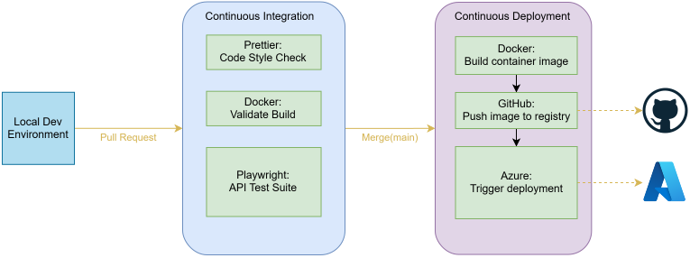

# Kilocal Nutrition Tracker

A lightweight, cloud-based nutrition dashboard designed to make calorie counting and macronutrient tracking as simple and easy as possible.

[Live Demo](https://kcal.ansengarvin.com/) (Note: It can be slow to load initially)

## The Motivation

I built this project for three reasons:

1. I was unsatisfied with other nutrition trackers that I had tried in the past, which were either excessively paywalled or overly complicated with unneeded features.
2. I wanted to deepen my understanding of cloud-native technologies and cloud hosting
3. I wanted hands-on experience implementing a CI/CD pipeline with automated testing and deployment

## The Stack

| Component | Technology              |
| --------- | ----------------------- |
| Frontend  | React, TypeScript       |
| Backend   | Node.js, Express        |
| Database  | MSSQL                   |
| Auth      | Firebase Authentication |
| Container | Docker                  |
| Hosting   | Azure                   |
| Testing   | Playwright              |
| CI/CD     | GitHub Actions          |

## Cloud Architecture: Azure

To achieve my goal of learning more about cloud technology, I wanted to deploy this app to a popular cloud hosting platform. When researching my options, my primary concern was **budget.** I found that Azure offers a pretty generous [free tier](https://azure.microsoft.com/en-us/pricing/free-services) which included all of the basic components I needed, so I went with them. Here's a diagram of my system in Azure:

Both the front and back end are containerized and deployed as Azure container apps. They are each publically accessible: The front-end container serves static files, and the back end provides a RESTful API that interfaces with my database.

## Development and CI/CD Pipeline

My development pipelane takes place over three stages:

### 1. Local Dev Environment

In a local dev environment, the frontend, backend, and a local MSSQL database are containerized and made accessible by Docker compose. A firebase emulator is also set up using the production server as a template (as not to interfere with production)

### 2. Continuous Integration

Each CI check is run in parallel using GitHub Actions. While API testing, the actions worker uses the same framework as the local dev environment (with a local database and firebase emulator).

### 3. Continuous Development

Each Azure container app has access to a GitHub container registry. After a merge into main, the front and back ends are containerized, pushed to their registries, and Actions deploys them to Azure.

## Personal Thoughts: What I've learned so far

1. **Automated Testing is amazing.** I didn't implement a (functional) automated test suite until late in the project, after I had already written most of the API calls. During its initial implementation alone, I discovered around 10 bugs that I hadn't previously noticed.

2. **CI & CD are huge time savers.** It seems obvious in hindsight, but I didn't fully appreciate _how much_ time it would save me until actually implementing it. Even the small stuff that seemed unecessary for a solo developer ended up saving a ton of time. For example, code formatting: I didn't realize how much time I was spending manually styling code until I turned on format-on-save ahead of my CI linting test.

## What could still be improved?

- **Container Apps are a poor choice for the frontend.** My entire front end is a static, single-page react application which interfaces with the rest of the application through a public RESTful API. The only purpose the front-end container serves is to run npm-serve to serve the content. It's functional, but it's far slower and an inefficient use of resources. Azure has better solutions for static hosting.

- **Addition of a staging environment.** Right now, my entire testing process (both in local development and in CI) uses a local database and emulator. Because of this, some bugs that are solely present in cloud-deployed builds are undetected until they reach production. To resolve this, a separate staging environment which closely mimics production should be set up.

- **Containers take forever to spool up.** As I mention in [#30](https://github.com/ansengarvin/kilocal/issues/30), my container apps scale from 0 to 10. This is an important cost-saving measure, since container apps don't consume any free-tier resources when they're scaled down to 0. When a container app scales from 0 to 1, it does a "cold-start," where it has to download the images and start up the containers. It's time-consuming, and leaves the application hanging / loading for an unacceptable amount of time.

- **General front-end improvements.** The website is pretty ugly right now. It doesn't display well on all mobile devices. The profile page is practically non-existant.
